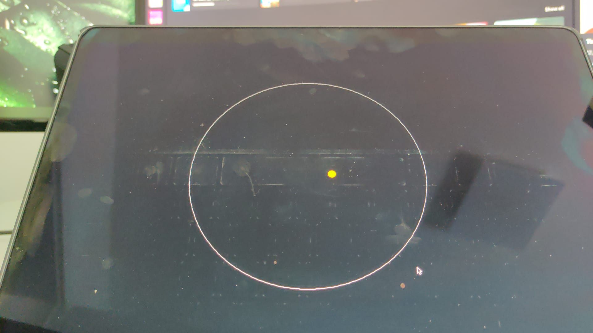

# Mars Weather Data Visualization

## Introduction

This project is part of the Generative Design 2 course. It focuses on visualizing Mars weather data obtained from the [NASA API](https://api.nasa.gov/), which offers access to a wide range of datasets and APIs for public use.

## Data Source

The data for this project was sourced from the NASA API, which provides comprehensive and detailed information about Mars weather conditions.

## Visualization Overview

### Initial Visualization

The initial visualization aimed to represent the orbits of the planets and display Mars weather data effectively. However, we encountered several challenges in the design phase.

### Design Challenges

1. **Scaling Issues**: One of the primary challenges was representing the orbits of each planet accurately. Using the true scale of the planetary orbits resulted in a visually unappealing design. Conversely, creating a visually pleasing design meant compromising on the accurate representation of the planetary scales. The vast differences in the sizes and distances of planets posed significant difficulties in achieving both scientific accuracy and aesthetic appeal.

## Conclusion

This project highlights the complexities involved in balancing accurate scientific representation with visual aesthetics in data visualization. While the true scales of planetary orbits and sizes are challenging to depict in a visually appealing way, the project offers valuable insights into the intricacies of data visualization in the context of astronomical data.

For more information about the data used and the APIs available, please visit the [NASA API website](https://api.nasa.gov/).
